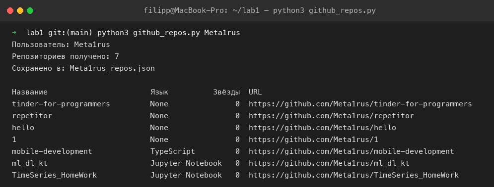
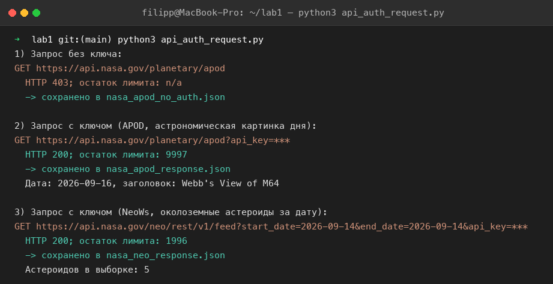

# Лабораторная 1 — работа с API

## Задание 1. GitHub API: список репозиториев пользователя

**Документация:** https://docs.github.com/en/rest/repos/repos#list-repositories-for-a-user

**Эндпоинт:** `GET https://api.github.com/users/{username}/repos`

Параметры запроса, которые использованы:

| Параметр   | Значение  | Зачем |
|------------|-----------|-------|
| `per_page` | 100       | максимум записей на страницу (по умолчанию 30) |
| `page`     | 1, 2, …   | постраничный обход, пока ответ не станет пустым |
| `sort`     | `updated` | сортировка по дате обновления |

Заголовки: `Accept: application/vnd.github+json` и `X-GitHub-Api-Version: 2022-11-28` —
рекомендованы документацией. Без токена лимит 60 запросов/час, с токеном
(`Authorization: Bearer <token>`, переменная окружения `GITHUB_TOKEN`) — 5000.

**Файлы:**
- `github_repos.py` — скрипт;
- `Meta1rus_repos.json` — сохранённый JSON-ответ (7 репозиториев пользователя `Meta1rus`);
- `octocat_repos.json` — сохранённый JSON-ответ демо-пользователя `octocat`;
- `terminal_github_repos.png` — скриншот работы скрипта.

Запуск для любого пользователя:
```bash
python3 github_repos.py Meta1rus
```



## Задание 2. API с авторизацией

Каталог ProgrammableWeb (https://www.programmableweb.com/category/all/apis) закрыт
в 2023 году и больше не открывается. Использован аналогичный каталог открытых API —
https://github.com/public-apis/public-apis (раздел *Science & Math*).

**Выбранное API:** NASA Open APIs, https://api.nasa.gov
**Тип авторизации:** API key. Ключ передаётся в query-параметре `api_key`.
Ключ получен после персональной регистрации (имя + e-mail) на `api.nasa.gov`:
`hmtYnLTLanrRLFnolKLnqISkaoZCIhus1j6ziJgv`.
Для тестов также поддерживается переменная окружения `NASA_API_KEY` или встроенный `DEMO_KEY`.

Скрипт `api_auth_request.py` делает три запроса:

| # | Запрос | Авторизация | Результат | Файл |
|---|--------|-------------|-----------|------|
| 1 | `/planetary/apod` | нет | HTTP 403, `API_KEY_MISSING` — подтверждение, что API требует ключ | `nasa_apod_no_auth.json` |
| 2 | `/planetary/apod` | `api_key` | HTTP 200, астрономическая картинка дня | `nasa_apod_response.json` |
| 3 | `/neo/rest/v1/feed?start_date=…&end_date=…` | `api_key` | HTTP 200, список околоземных астероидов за дату | `nasa_neo_response.json` |

Остаток лимита сервер возвращает в заголовке `X-RateLimit-Remaining` (для персонального ключа лимит увеличен до 1000 запросов/час или 10 000 в сутки), скрипт его печатает.

Запуск:
```bash
python3 api_auth_request.py
```



