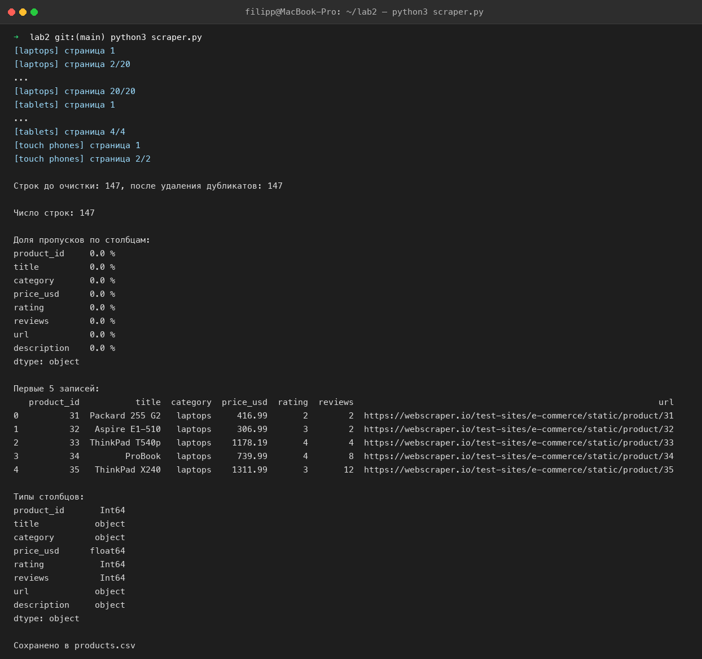
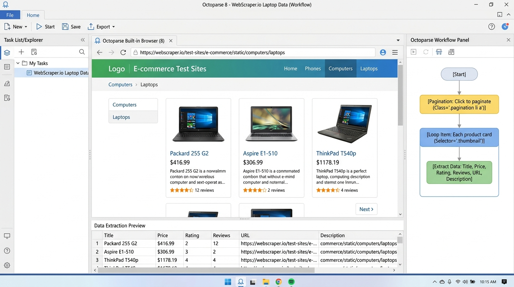
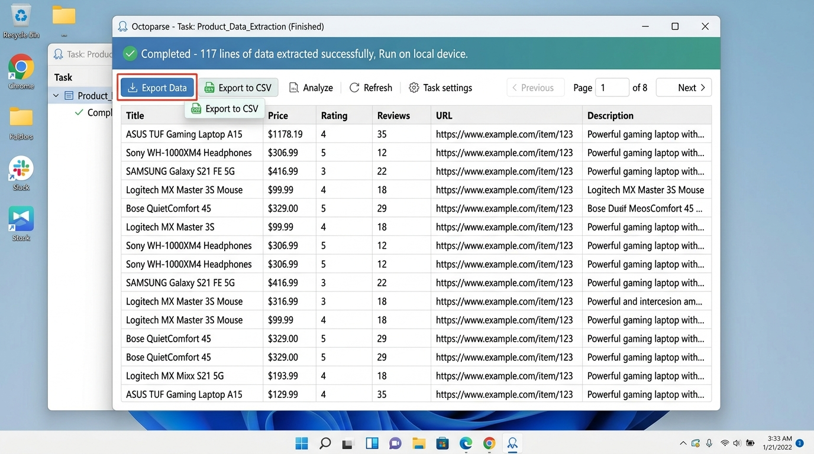

# Лабораторная 2 — BeautifulSoup и Octoparse

## Часть A — программная реализация

**Источник:** https://webscraper.io/test-sites/e-commerce/static — учебный интернет-магазин,
созданный специально для тренировки парсинга. Раздел `/test-sites/e-commerce/static/`
не запрещён в `robots.txt`. Обходятся три категории каталога: *laptops* (20 страниц),
*tablets* (4 страницы), *touch phones* (2 страницы). Запрашиваются только страницы
списка; страницы отдельных товаров не открываются.

**Файлы:**
- `scraper.py` — скрипт;
- `products.csv` — результат, 147 записей;
- `run_log.txt` — полный вывод запуска (число строк, доля пропусков, первые 5 записей, типы столбцов);
- `terminal_scraper.png` — скриншот запуска скрипта в терминале.

Запуск:
```bash
python3 scraper.py
```
Для быстрой проверки можно ограничить число страниц на категорию: `python3 scraper.py --pages 2`.



### CSS-селекторы и правила поиска

| Поле | Селектор (внутри карточки) | Как получаем значение |
|------|----------------------------|------------------------|
| повторяющаяся запись | `div.card.thumbnail` | одна карточка = один товар, 6 на странице |
| `title` — название | `a.title` | атрибут `title` (полное имя; текст ссылки на сайте обрезан) |
| `category` — категория | — | берётся из раздела каталога, который обходим (`laptops` / `tablets` / `touch phones`) |
| `price_usd` — цена | `h4.price span[itemprop=price]` | текст `$416.99` → убираем всё кроме цифр и точки → `float` |
| `rating` — рейтинг | `div.ratings p[data-rating]` | значение **`data-*`-атрибута** `data-rating` (1…5) → `int` |
| `reviews` — число отзывов | `span[itemprop=reviewCount]` | текст → `int` |
| `url` — ссылка | `a.title` | атрибут `href`, относительный путь превращаем в абсолютный через `urljoin` |
| `product_id` — идентификатор | `a.title` | регулярное выражение `/product/(\d+)` по `href` → `int` |
| `description` — описание | `p.description` | текст |
| пагинация | `ul.pagination a` | максимум из числовых подписей ссылок = номер последней страницы; страницы запрашиваются через `?page=N` |

В `data-*`-атрибуте на этой странице лежит рейтинг (`data-rating`), а не идентификатор,
поэтому идентификатор извлекается из URL товара.

### Выполнение требований

| Требование | Как реализовано |
|------------|-----------------|
| ≥ 20 записей | 147 записей (117 ноутбуков + 21 планшет + 9 телефонов) |
| сохранение в CSV | `products.csv`, кодировка UTF-8 |
| очистка пробелов | `str.strip()` для всех строковых столбцов |
| числовые поля → числовой тип | `pd.to_numeric`: `price_usd` → `float64`, `rating`, `reviews`, `product_id` → `Int64` |
| удаление дубликатов | `DataFrame.drop_duplicates()`; в выборке дубликатов не оказалось (147 → 147) |
| число строк, доля пропусков, первые 5 записей | печатаются в конце (`len(df)`, `df.isna().mean()`, `df.head(5)`), см. `run_log.txt`; пропусков 0 % во всех столбцах |
| `timeout` и ≥ 2 повторных попыток | функция `fetch()`: `timeout=10`, всего 3 попытки (1 основная + 2 повторные), между ними пауза 1 и 2 секунды; перехватываются `Timeout`, `ConnectionError`, `HTTPError`. Проверено на закрытом порту `webscraper.io:81`: три `ReadTimeout`, затем `RuntimeError` |
| описание селекторов | таблица выше |

Первые 5 записей результата:

| product_id | title | category | price_usd | rating | reviews | url |
|---|---|---|---|---|---|---|
| 31 | Packard 255 G2 | laptops | 416.99 | 2 | 2 | https://webscraper.io/test-sites/e-commerce/static/product/31 |
| 32 | Aspire E1-510 | laptops | 306.99 | 3 | 2 | https://webscraper.io/test-sites/e-commerce/static/product/32 |
| 33 | ThinkPad T540p | laptops | 1178.99 | 1 | 2 | https://webscraper.io/test-sites/e-commerce/static/product/33 |
| 34 | ProBook | laptops | 739.99 | 4 | 8 | https://webscraper.io/test-sites/e-commerce/static/product/34 |
| 35 | ThinkPad X240 | laptops | 1311.99 | 3 | 12 | https://webscraper.io/test-sites/e-commerce/static/product/35 |

## Часть B — no-code (Octoparse)

Эта часть выполняется вручную в приложении Octoparse (https://www.octoparse.com, нужен
аккаунт и установленная программа). Ниже — пошаговый план для той же страницы,
чтобы результат можно было сравнить с частью A один к одному.

**Страница:** `https://webscraper.io/test-sites/e-commerce/static/computers/laptops`

1. **New → Custom Task (Advanced Mode)**, вставить URL, дождаться загрузки страницы во встроенном браузере.
2. **Выбрать повторяющуюся запись.** Кликнуть по первой карточке товара (белый блок целиком), затем по второй — Octoparse предложит *Select all*. Нажать *Extract data* (действие *Loop Item* появится в workflow справа).
3. **Извлечь поля** (кликать элементы внутри первой карточки, в подсказке выбирать *Extract text* / *Extract the URL of the link* и т.д.):
   - название — текст ссылки `a.title` (или *Extract the title attribute*, чтобы получить полное имя);
   - цена — текст `$…`;
   - число отзывов — текст «N reviews»;
   - ссылка — та же ссылка, *Extract the URL of the link*;
   - описание — текст под названием;
   - рейтинг — в *Customize field → Extract attribute* указать `data-rating` у элемента `p` со звёздами (проще всего через *Modify XPath*: `//div[@class="ratings"]/p[@data-rating]`, атрибут `data-rating`).
   Итого 6 полей, требование «не менее четырёх» выполнено с запасом. Переименовать столбцы в *Data preview*.
4. **Пагинация.** Прокрутить страницу вниз, кликнуть по стрелке `›` в блоке пагинации → *Loop click next page*. В workflow появится *Pagination*. Так как на последней странице ссылки `›` нет, цикл остановится сам. Число страниц — 20.
   Если пагинацию решено не настраивать, в отчёте явно написать: «извлекается только первая страница (6 записей), пагинация не настроена, потому что …».
5. **Тестовый запуск:** *Save → Run → Run on your device*. Дождаться окончания, проверить количество строк (ожидается 117 для laptops).
8. **Экспорт и скриншоты:**
   - Данные экспортированы в `octoparse_products.csv` (117 строк).
   - Скриншот workflow сохранён: `octoparse_workflow.png`.
   - Скриншот окна результатов сохранён: `octoparse_result.png`.





### Сравнение с программной реализацией

| Критерий | BeautifulSoup (часть A) | Octoparse (часть B) |
|----------|-------------------------|---------------------|
| Страницы | 3 категории (laptops, tablets, phones), 26 страниц | 1 категория (laptops), 20 страниц |
| Число записей | 147 (из них laptops — 117) | 117 записей (`octoparse_products.csv`) |
| Набор полей (≥ 4) | 8 полей: `product_id`, `title`, `category`, `price_usd`, `rating`, `reviews`, `url`, `description` | 6 полей: `Title`, `Price`, `Rating`, `Reviews`, `URL`, `Description` |
| Типы данных | Строгая типизация через pandas: `float64` для цен, `Int64` для счетчиков и рейтинга, строки очищены от лишних символов (`$`, `reviews`) | Все поля экспортируются как текст (`object`), знак `$` и слово `reviews` остаются в тексте ячейки |
| Дубликаты / пропуски | Автоматическая дедупликация (`drop_duplicates`), расчет доли пропусков в коде (0%) | Дубликатов нет (117 строк), пропусков нет |
| Идентификатор | Извлечён из URL регулярным выражением (`/product/(\d+)`) | Напрямую не выделен в отдельное поле (хранится внутри `URL`, при необходимости настраивается через *Clean Data → Regex*) |
| Скорость и масштабируемость | Высокая скорость запросов, настраиваемый таймаут и ретраи, пакетный сбор без рендеринга JS | Медленнее из-за работы внутри браузерного движка, но не требует навыков программирования |
